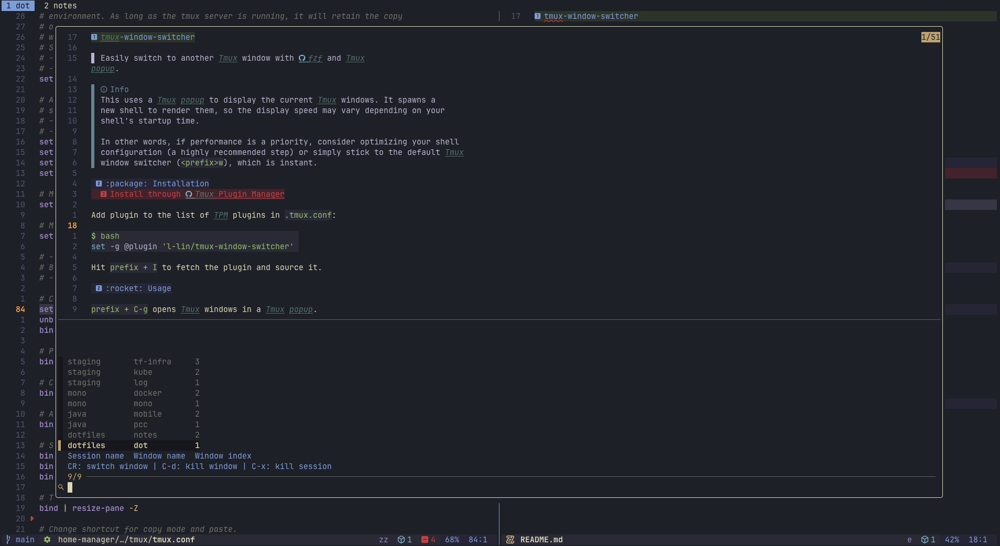

# tmux-window-switcher

> Easily switch to another Tmux window with [fzf](https://github.com/junegunn/fzf) and Tmux popup.

> 

> [!TIP]
> This plugin uses a Tmux popup to show your windows, ordered by most recent
> access. It launches a new shell to render the list, so display speed depends
> on your shell's startup time.
>
> If you want the fastest possible experience, consider optimizing your shell
> configuration (which is highly recommended), or use the default Tmux window
> switcher (`<prefix>w`), which is instant.

## :package: Installation
### Install through [Tmux Plugin Manager](https://github.com/tmux-plugins/tpm)

Add plugin to the list of TPM plugins in `.tmux.conf`:

```bash
set -g @plugin 'l-lin/tmux-window-switcher'
```

Hit `prefix + I` to fetch the plugin and source it.

## :rocket: Usage

`prefix + C-g` opens Tmux windows in a Tmux popup.

## :wrench: Configuration

Default configuration:

```bash
set -g @tmux-window-switcher-key-binding 'C-g'
set -g @tmux-window-switcher-width '90%'
set -g @tmux-window-switcher-height '90%'
set -g @tmux-window-switcher-order-strategy 'history'
```

## :page_with_curl: License

[MIT](./LICENSE)

